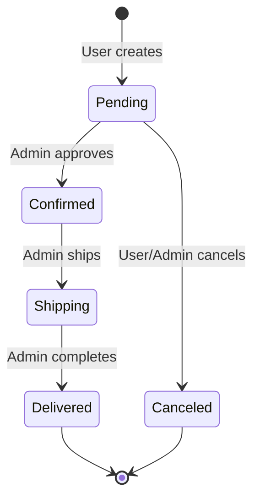

# State Transition Tester

## 1. Nền tảng Kiến thức Cốt lõi (Domain Knowledge)

Kỹ năng này chuyên sinh test case kiểm tra hành vi chuyển đổi trạng thái dựa trên lý thuyết Máy Trạng Thái Hữu Hạn (Finite State Machine - FSM) theo chuẩn ISTQB.

### 1.1. Khái niệm Máy Trạng Thái (FSM)
- **State (Trạng thái)**: Điều kiện hiện tại của một thực thể (VD: `pending`, `active`, `canceled`).
- **Transition (Chuyển đổi)**: Sự thay đổi từ trạng thái $S_i$ sang trạng thái $S_j$ thông qua một Action (API endpoint).
- **Guard Condition (Điều kiện rào chắn)**: Điều kiện phụ quyết định chuyển đổi có được phép hay không (VD: Quyền của người dùng, số dư ví).
- **Terminal State (Trạng thái kết thúc)**: Trạng thái không có mũi tên đi ra (VD: `delivered`, `refunded`). Bất biến ở trạng thái này.

### 1.2. Chiến lược Độ phủ (Coverage Criteria)
- **0-switch coverage (State Coverage)**: Đảm bảo mọi trạng thái (Node) đều được kiểm thử ít nhất 1 lần.
- **1-switch coverage (Transition Coverage)**: Đảm bảo mọi chuyển đổi hợp lệ (Edge/Arrow) đều được kích hoạt ít nhất 1 lần. Đạt độ phủ 100% Happy Path.
- **N-switch coverage (Path Coverage)**: Kiểm thử chuỗi N+1 chuyển đổi liên tiếp để phát hiện lỗi tích lũy trạng thái.

### 1.3. Ma trận Chuyển đổi Âm bản (Negative State Matrix)
Bắt buộc kiểm thử các chuyển đổi KHÔNG hợp lệ:
- **Nhảy cóc trạng thái (State Skipping)**: Cố tình bỏ qua các bước bắt buộc (VD: `pending` $\to$ `delivered` ngay lập tức).
- **Lùi trạng thái (State Regression)**: Đi ngược lại quy trình một chiều (VD: `shipping` $\to$ `confirmed`).
- **Vi phạm trạng thái kết thúc (Terminal Violation)**: Cố thay đổi trạng thái khi đã ở Terminal State (VD: `canceled` $\to$ `pending`).

### 1.4. Phân quyền và Tính Đồng thời (RBAC & Concurrency)
- **Role-based Transitions**: Cùng một Action, nhưng User thường bị chặn (`403 Forbidden`) trong khi Admin được phép (`200 OK`). Bảng phân quyền chuyển trạng thái.
- **Idempotency (Tính lũy đẳng trạng thái)**: Gọi cùng một Transition hai lần liên tiếp (chuyển từ $S_i \to S_i$). Server phải xử lý an toàn (trả về 200/409) mà không gây hỏng dữ liệu.
- **Race Conditions (TOCTOU)**: Hai luồng cố gắng chuyển từ $S_i$ sang 2 trạng thái mâu thuẫn ($S_j$ và $S_k$) trong cùng một mili-giây.

---

## 2. Cấu hình Ngữ cảnh Hệ thống (SUT Context Bindings)
*Tiêm các tham số ngữ cảnh cụ thể của dự án vào prompt trước khi gọi kỹ năng.*

- **Base URL & Headers**: (VD: `http://localhost:3000`, `X-Student-Id`)
- **Danh sách Trạng thái (States)**: Định nghĩa các trạng thái của SUT (VD: Đơn hàng, Tài khoản).
- **Quy tắc Chuyển đổi & Quyền (Rules)**: Mô tả quy trình nghiệp vụ hợp lệ và ai có quyền thực hiện.

---

## 3. Định dạng Kết quả Đầu ra (Output Format)

### 3.1. Biểu đồ Trạng Thái (Mermaid Diagram)
Vẽ biểu đồ dạng Mermaid thể hiện FSM, bao gồm cả Role trên các mũi tên.

### 3.2. Bảng Test Case
- Mã ID Test Case: `TC-STA-001`, `TC-STA-002`,...
- **Tên test case (Name)** PHẢI được viết bằng tiếng Anh.

| TC ID | Name | Precondition (Current State + Role) | Action (API Payload) | Expected Result | Transition Type |
|---|---|---|---|---|---|
| TC-STA-001 | Valid transition from pending to confirmed | Order `pending`, logged as Admin | PUT `/status` {`status`:'confirmed'} | 200 OK, State = `confirmed` | 1-switch Valid |
| TC-STA-002 | Invalid regression shipping to confirmed | Order `shipping`, logged as Admin | PUT `/status` {`status`:'confirmed'} | 400 Bad Request / 409 Conflict | Negative Matrix |
| TC-STA-003 | Terminal violation from canceled | Order `canceled`, logged as User | PUT `/status` {`status`:'pending'} | 400 Bad Request | Terminal Viol. |
| TC-STA-004 | Unauthorized cancellation in shipping | Order `shipping`, logged as User | PUT `/status` {`status`:'canceled'} | 403 Forbidden | RBAC Rule |
| TC-STA-005 | Idempotent transition to same state | Order `confirmed`, logged as Admin | PUT `/status` {`status`:'confirmed'} | 200 OK or 409 Conflict (Safe) | Idempotency |
