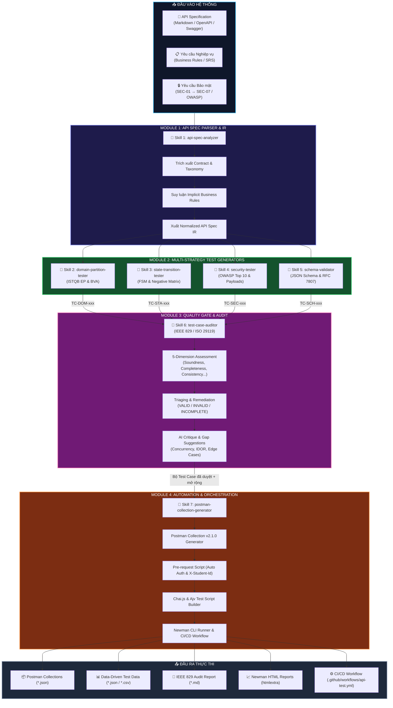
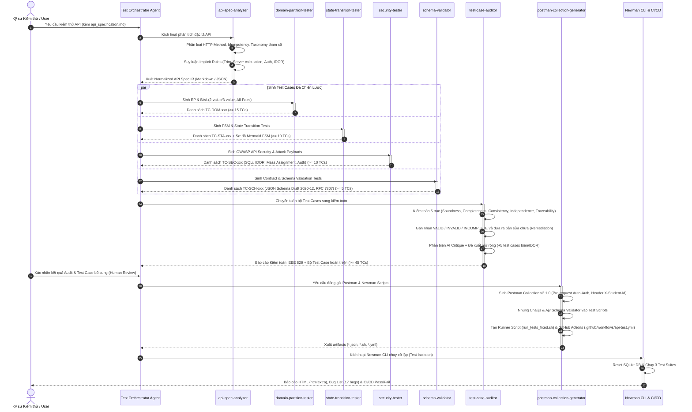

# Agent Skill — AI-Driven API Test Generator

## 1. Tổng quan Thiết kế

### 1.1. Mục tiêu
Hệ thống **AI-Driven API Test Generator** được thiết kế để tự động hóa toàn diện quy trình kiểm thử API hướng đối tượng, chuyển giao từ tài liệu đặc tả kỹ thuật (API Specification / SRS) sang các bộ kịch bản kiểm thử sẵn sàng thực thi (Executable Postman Collections, Newman CLI Runner, và CI/CD GitHub Actions Pipeline).

Hệ thống được xây dựng trên kiến trúc **Multi-Agent Skill Modular Pipeline** gồm **4 Module cốt lõi** và được hiện thực hóa qua **7 Agent Skills độc lập, có thể tái sử dụng** nằm trong thư mục `.agents/skills/`:

| STT | Agent Skill | Module đại diện | Chuẩn / Tiêu chuẩn áp dụng | Vai trò cốt lõi |
|:---:|---|---|---|---|
| 1 | **`api-spec-analyzer`** | Module 1: Parser & IR | RFC 9110, Parameter Taxonomy | Phân tích đặc tả API, trích xuất cấu trúc, suy luận quy tắc nghiệp vụ ngầm định (Implicit Rules) và sinh Normalized IR. |
| 2 | **`domain-partition-tester`** | Module 2: Strategy Generator | ISTQB FL EP & BVA (2-value, 3-value) | Sinh test case phân hoạch tương đương, phân tích giá trị biên, robustness testing và tổ hợp All-Pairs. |
| 3 | **`state-transition-tester`** | Module 2: Strategy Generator | ISTQB FL FSM, 0/1/N-switch | Mô hình hóa máy trạng thái hữu hạn, sinh ma trận chuyển đổi âm bản (Negative State Matrix), kiểm tra Terminal state và RBAC. |
| 4 | **`security-tester`** | Module 2: Strategy Generator | OWASP API Security Top 10 (2023) | Sinh các kịch bản kiểm thử thâm nhập: BOLA/IDOR, Broken Auth, Mass Assignment, BFLA, SQLi, XSS, SSRF. |
| 5 | **`schema-validator`** | Module 2: Strategy Generator | JSON Schema Draft 2020-12, RFC 7807 | Kiểm thử hợp đồng dữ liệu nghiêm ngặt (`additionalProperties: false`), HTTP Status contract và cấu trúc báo lỗi thống nhất. |
| 6 | **`test-case-auditor`** | Module 3: Quality Gate & Review | IEEE 829 / ISO 29119, AI Critique | Đánh giá chất lượng bộ test case theo 5 chiều, gán nhãn VALID / INVALID / INCOMPLETE, phản biện AI và tự động đề xuất mở rộng (Gap Analysis). |
| 7 | **`postman-collection-generator`** | Module 4: Orchestrator & Execution | Postman Schema v2.1.0, Newman CLI | Chuyển đổi test cases thành Postman Collection JSON, sinh Pre-request Scripts (Auto Auth, Header `X-Student-Id`), Test Scripts (Chai.js, Ajv) và CI/CD workflow. |

---

## 2. Sơ đồ Kiến trúc & Luồng Dữ liệu (Mermaid Diagrams)

### 2.1. Sơ đồ Kiến trúc Pipeline Tổng quan (System Architecture)



---

### 2.2. Sơ đồ Sequence Tương tác giữa các Agent Skills (Sequence Diagram)



---

## 3. Chi tiết 7 Agent Skills trong Kiến trúc

### 3.1. Skill 1: `api-spec-analyzer`
- **Mục tiêu:** Chuyển đổi đặc tả thô thành **Normalized Intermediate Representation (IR)** chuẩn hóa để làm đầu vào cho các generator.
- **Nền tảng tri thức:**
  - **RFC 9110 HTTP Semantics:** Xác định tính lũy đẳng (`GET`, `PUT`, `DELETE`) vs không lũy đẳng (`POST`, `PATCH`), phân loại kiến trúc CRUD vs Stateful.
  - **Parameter Taxonomy:** Phân tách Path Variables, Query Params, Header Params, Request Body JSON fields.
  - **Implicit Business Rules Engine:** Tự động suy luận các quy tắc ngầm định ngành:
    1. *Auth & Identity:* Tự động trim khoảng trắng 2 đầu email; forgot-password không làm lộ danh sách user; token sai trả `401`.
    2. *Calculation:* Mọi tổng tiền/giá phải do Server tính toán lại, không tin tưởng client; số lượng $\ge 1$, giá $\ge 0$.
    3. *Data Integrity:* Chặn IDOR bằng kiểm tra quyền sở hữu; tạo trùng unique key trả `409` hoặc `400`.
    4. *Protocol:* Từ chối sai Media Type với `415`; field lạ không làm sập server `500`; lỗi theo RFC 7807.

---

### 3.2. Skill 2: `domain-partition-tester`
- **Mục tiêu:** Sinh test case kiểm tra miền dữ liệu và biên theo chuẩn ISTQB.
- **Nền tảng tri thức:**
  - **2-value BVA (Chuẩn ISTQB):** Kiểm thử tại biên hợp lệ và giá trị sát ngoài biên gần nhất ($0, 1, N, N+1$).
  - **3-value BVA & Robustness:** Kiểm thử biên cực đại, cực tiểu, số âm, overflow/underflow.
  - **Type Catalogs:**
    - *String:* Chuỗi rỗng `""`, 1 ký tự, max length $N$, $N+1$, khoảng trắng thuần `"   "`, unicode/emoji, format email/password.
    - *Number:* Số âm (`-1`), zero (`0`), số thực (`0.01`), max safe int (`2147483647`), string coercion (`"123"`).
    - *Array:* Mảng rỗng `[]`, mảng 1 phần tử `[x]`, max items, chứa `null`, chứa duplicate items.
    - *Object:* Thiếu required key, thừa key lạ, object rỗng `{}`, `null`.
  - **Combinatorial Testing (All-Pairs):** Positive test kết hợp nhiều biên hợp lệ; Negative test chỉ chứa **1 trường lỗi duy nhất** nhằm cô lập lỗi (Fault Isolation).

---

### 3.3. Skill 3: `state-transition-tester`
- **Mục tiêu:** Kiểm tra vòng đời đối tượng dựa trên Máy Trạng Thái Hữu Hạn (FSM).
- **Nền tảng tri thức:**
  - **Mô hình hóa FSM:** Định nghĩa States, Transitions, Actions, Guard Conditions, và Terminal States.
  - **Độ phủ ISTQB:**
    - *0-switch (State Coverage):* Mọi trạng thái xuất hiện ít nhất 1 lần.
    - *1-switch (Transition Coverage):* Mọi chuyển đổi hợp lệ được kích hoạt ít nhất 1 lần (100% Happy Path).
    - *N-switch (Path Coverage):* Chuỗi $N+1$ chuyển đổi liên tiếp.
  - **Negative State Transition Matrix:**
    - *State Skipping:* Nhảy cóc trạng thái (VD: `pending` $	o$ `delivered`).
    - *State Regression:* Lùi trạng thái trái phép (VD: `shipping` $	o$ `confirmed`).
    - *Terminal State Violation:* Thay đổi trạng thái đã kết thúc (VD: `canceled` $	o$ `delivered`).
  - **RBAC & Concurrency:** Role-based transition matrix (User vs Admin), tính lũy đẳng trạng thái (chuyển $S_i 	o S_i$), và kiểm tra Race Condition (TOCTOU).

---

### 3.4. Skill 4: `security-tester`
- **Mục tiêu:** Sinh các kịch bản kiểm thử thâm nhập và an toàn thông tin theo chuẩn **OWASP API Security Top 10 (2023)**.
- **Nền tảng tri thức:**
  - **API1:2023 — BOLA / IDOR:** Thay đổi ID trên URL/Body xem dữ liệu của user khác mà không có quyền.
  - **API2:2023 — Broken Authentication:** Token thiếu, hết hạn, chữ ký sai, `alg: none`, brute-force lockout.
  - **API3:2023 — Mass Assignment:** Tiêm các trường ẩn: `{"role": "admin"}`, `{"is_admin": true}`, `{"balance": 999999}`.
  - **API4:2023 — Unrestricted Resource Consumption:** Payload cực lớn, ReDoS, spam request liên tục.
  - **API5:2023 — Broken Function Level Auth (BFLA):** Regular user gọi các admin endpoints (`/api/admin/*`).
  - **API8:2023 — Security Misconfiguration:** Kiểm tra lộ Stack Trace, thiếu Security Headers (`X-Content-Type-Options: nosniff`).
  - **Attack Payloads:** SQL Injection (`' OR 1=1 --`, `UNION SELECT`), XSS (`<script>alert(1)</script>`), Command Injection.

---

### 3.5. Skill 5: `schema-validator`
- **Mục tiêu:** Đảm bảo Contract Testing nghiêm ngặt giữa Client và Server.
- **Nền tảng tri thức:**
  - **JSON Schema Draft 2020-12:**
    - Type validation (kiểm tra kiểu chính xác, không ép kiểu ngầm).
    - Format validation (`email`, `date-time`, `uuid`).
    - Required keys & Strict Contract (`additionalProperties: false` để chống rò rỉ dữ liệu nhạy cảm).
  - **HTTP Status Code Conformance:** `200/201` thành công, `400` dữ liệu sai, `401` chưa auth, `403` cấm quyền, `404` không tìm thấy, `415` sai Media Type, `409` conflict logic, **chặn triệt để lỗi `500`**.
  - **RFC 7807 Error Envelope:** Cấu trúc lỗi đồng nhất `{ "error": string }`, không chứa stack trace hoặc dấu vết hệ điều hành.

---

### 3.6. Skill 6: `test-case-auditor`
- **Mục tiêu:** Đóng vai trò Senior QA Auditor kiểm định chất lượng bộ test case theo chuẩn **IEEE 829 / ISO 29119**.
- **Nền tảng tri thức:**
  - **5 Trục Đánh Giá:**
    1. *Soundness (Độ đúng đắn):* Không chấp nhận ảo tưởng AI (hallucination), kỳ vọng mã HTTP phải chuẩn.
    2. *Completeness (Tính đầy đủ):* Đạt đủ 4 nhóm chiến lược, tối thiểu $\ge 35$ test cases / API.
    3. *Consistency (Tính nhất quán):* Không mâu thuẫn giữa các test case.
    4. *Independence (Tính độc lập):* Test case không bị flaky, không phụ thuộc thứ tự chạy.
    5. *Traceability (Khả năng truy vết):* Ánh xạ rõ ràng về Functional Requirement (FR-xx) hoặc Security Requirement (SEC-xx).
  - **Gán nhãn Triaging:** `VALID` (chuẩn), `INVALID` (sai kỹ thuật $	o$ viết lại), `INCOMPLETE` (thiếu chiều sâu $	o$ bổ sung assertion).
  - **AI Critique & Gap Analysis:** Chỉ ra điểm yếu thiên lệch của AI và tự động đề xuất $\ge 5$ test cases chuyên sâu (IDOR, Concurrency, Atomic rollback).

---

### 3.7. Skill 7: `postman-collection-generator`
- **Mục tiêu:** Chuyển đổi toàn bộ test design thành mã kịch bản thực thi tự động.
- **Nền tảng tri thức:**
  - **Postman Collection Schema v2.1.0:** Tổ chức thư mục rõ ràng theo nhóm chức năng và chiến lược.
  - **Variable Scoping:** Phân định rõ Global, Environment (`base_url`, `student_id`), Collection (`admin_token`, `order_id`), và Iteration Data (`pm.iterationData`).
  - **Pre-request Automation:**
    - Tự động gán Header `X-Student-Id: 23127378`.
    - Auto Authentication (gọi API login lấy token gán vào header runtime).
    - Data serialization và FSM Precondition chain.
  - **Test Assertions (Chai.js & Ajv):** Kiểm tra HTTP status, response time, response body data types và JSON schema.
  - **Newman CLI Orchestration:** Cấu hình lệnh chạy Newman với `newman-reporter-htmlextra`, cờ `--delay-request`, và kịch bản khởi động lại server (`run_tests_fixed.sh`) để bảo đảm tính độc lập môi trường (Test Isolation).
  - **CI/CD Pipeline Generator:** Tự động sinh file GitHub Actions workflow `.github/workflows/api-test.yml`.

---

## 4. Mã giả Thiết kế Hệ thống (Python Pseudocode)

```python
"""
AI-Driven API Test Generator — Architectural Pseudocode
Implements 7 Agent Skills across 4 Core Modules
Author: Nguyen Gia Huy (23127378)
"""

from typing import List, Dict, Any, Optional
from dataclasses import dataclass, field
import json


# ============================================================================
# DATA STRUCTURES & INTERMEDIATE REPRESENTATION (IR)
# ============================================================================

@dataclass
class ParameterSpec:
    name: str
    location: str  # 'path', 'query', 'header', 'body'
    data_type: str  # 'string', 'number', 'integer', 'boolean', 'array', 'object'
    required: bool
    constraints: Dict[str, Any] = field(default_factory=dict)  # min, max, regex, format


@dataclass
class NormalizedAPISpecIR:
    endpoint: str
    method: str
    auth_role: str  # 'public', 'user', 'admin'
    required_headers: List[str]
    is_idempotent: bool
    parameters: List[ParameterSpec]
    expected_responses: Dict[int, Dict[str, Any]]
    explicit_rules: List[str]
    implicit_rules: List[str]
    state_machine: Optional[Dict[str, Any]] = None
    security_risks: List[str] = field(default_factory=list)


@dataclass
class TestCase:
    tc_id: str
    name: str
    category: str  # 'Domain Partition', 'State Transition', 'Security', 'Schema Validation'
    precondition: str
    input_data: Dict[str, Any]
    expected_status: int
    expected_response: Dict[str, Any]
    audit_verdict: str = "PENDING"  # VALID, INVALID, INCOMPLETE
    audit_notes: str = ""
    remediation: Optional[str] = None


# ============================================================================
# MODULE 1: API SPEC ANALYZER (SKILL 1)
# ============================================================================

class APISpecAnalyzer:
    """Skill 1: Parses raw API specification and infers implicit business rules."""

    def __init__(self, raw_spec_text: str):
        self.raw_spec = raw_spec_text

    def parse(self, endpoint: str, method: str) -> NormalizedAPISpecIR:
        # 1. Extract endpoint metadata and parameters
        params = self._extract_parameters(endpoint, method)
        responses = self._extract_responses(endpoint, method)
        
        # 2. Determine RFC 9110 Idempotency
        is_idempotent = method.upper() in ["GET", "PUT", "DELETE", "HEAD", "OPTIONS"]
        
        # 3. Infer Implicit Business Rules (Industry Standards)
        implicit_rules = []
        for p in params:
            if p.data_type == "string" and "email" in p.name.lower():
                implicit_rules.append("Auto-trim whitespace on email; case-insensitive matching")
            if p.data_type == "number" and "price" in p.name.lower():
                implicit_rules.append("Price must be strictly positive (> 0); verified on server")
        implicit_rules.append("Reject unsupported Media Type with 415; uniform RFC 7807 error format")
        implicit_rules.append("IDOR protection: verify ownership on all resource access")

        return NormalizedAPISpecIR(
            endpoint=endpoint,
            method=method,
            auth_role="admin" if "/admin" in endpoint else ("public" if "login" in endpoint else "user"),
            required_headers=["X-Student-Id", "Content-Type"],
            is_idempotent=is_idempotent,
            parameters=params,
            expected_responses=responses,
            explicit_rules=self._extract_explicit_rules(endpoint),
            implicit_rules=implicit_rules,
            security_risks=["IDOR", "Mass Assignment", "SQLi", "Broken Auth"]
        )

    def _extract_parameters(self, endpoint: str, method: str) -> List[ParameterSpec]:
        # Concrete implementation extracting params from spec AST/Regex
        return [
            ParameterSpec("email", "body", "string", True, {"format": "email", "maxLength": 255}),
            ParameterSpec("password", "body", "string", True, {"minLength": 6, "maxLength": 100})
        ]

    def _extract_responses(self, endpoint: str, method: str) -> Dict[int, Dict[str, Any]]:
        return {
            200: {"description": "Success", "schema": {"token": "string", "user": "object"}},
            400: {"description": "Bad Request", "schema": {"error": "string"}},
            401: {"description": "Unauthorized", "schema": {"error": "string"}}
        }

    def _extract_explicit_rules(self, endpoint: str) -> List[str]:
        return ["Lock account after failed attempts", "Password must meet complexity requirements"]


# ============================================================================
# MODULE 2: TEST GENERATORS (SKILLS 2, 3, 4, 5)
# ============================================================================

class DomainPartitionTester:
    """Skill 2: Generates EP & BVA test cases based on ISTQB standards."""

    def generate(self, ir: NormalizedAPISpecIR) -> List[TestCase]:
        test_cases = []
        tc_count = 1

        # 1. Positive Tests (Valid partitions + valid boundaries)
        test_cases.append(TestCase(
            tc_id=f"TC-DOM-{tc_count:03d}",
            name="Valid standard inputs",
            category="Domain Partition",
            precondition="User exists in DB",
            input_data={"email": "valid@eshop.com", "password": "ValidPassword123!"},
            expected_status=200,
            expected_response={"has_token": True}
        ))
        tc_count += 1

        # 2. Negative BVA & EP per parameter (Fault Isolation principle)
        for param in ir.parameters:
            if param.data_type == "string":
                # Boundary: Empty string
                test_cases.append(TestCase(
                    tc_id=f"TC-DOM-{tc_count:03d}",
                    name=f"Invalid empty string for {param.name}",
                    category="Domain Partition",
                    precondition="None",
                    input_data={param.name: ""},
                    expected_status=400,
                    expected_response={"error": f"{param.name} cannot be empty"}
                ))
                tc_count += 1
                # Boundary: Exceed max length
                max_len = param.constraints.get("maxLength", 255)
                test_cases.append(TestCase(
                    tc_id=f"TC-DOM-{tc_count:03d}",
                    name=f"Invalid length exceeding boundary for {param.name} (N+1)",
                    category="Domain Partition",
                    precondition="None",
                    input_data={param.name: "a" * (max_len + 1)},
                    expected_status=400,
                    expected_response={"error": "Exceeds maximum length"}
                ))
                tc_count += 1

        return test_cases


class StateTransitionTester:
    """Skill 3: Generates FSM lifecycle, negative matrix, and terminal state tests."""

    def generate(self, ir: NormalizedAPISpecIR) -> List[TestCase]:
        test_cases = []
        # 1-switch Valid Transition
        test_cases.append(TestCase(
            tc_id="TC-STA-001",
            name="Valid transition from pending to confirmed by Admin",
            category="State Transition",
            precondition="Order exists in pending state; authenticated as Admin",
            input_data={"status": "confirmed"},
            expected_status=200,
            expected_response={"status": "confirmed"}
        ))
        # Terminal State Violation
        test_cases.append(TestCase(
            tc_id="TC-STA-002",
            name="Invalid transition from terminal state canceled to delivered",
            category="State Transition",
            precondition="Order exists in canceled state",
            input_data={"status": "delivered"},
            expected_status=400,
            expected_response={"error": "Cannot transition from canceled"}
        ))
        # RBAC State Guard
        test_cases.append(TestCase(
            tc_id="TC-STA-003",
            name="Unauthorized status update by regular user",
            category="State Transition",
            precondition="Order exists in pending state; authenticated as Regular User",
            input_data={"status": "confirmed"},
            expected_status=403,
            expected_response={"error": "Forbidden"}
        ))
        return test_cases


class SecurityTester:
    """Skill 4: Generates OWASP API Security Top 10 (2023) penetration test cases."""

    def generate(self, ir: NormalizedAPISpecIR) -> List[TestCase]:
        test_cases = []
        # API1: BOLA / IDOR
        test_cases.append(TestCase(
            tc_id="TC-SEC-001",
            name="IDOR - User B accesses User A order details",
            category="Security",
            precondition="Order owned by User A; authenticated with User B token",
            input_data={"order_id": "ORDER_USER_A_ID"},
            expected_status=403,
            expected_response={"error": "Access denied"}
        ))
        # API2: Missing JWT Token
        test_cases.append(TestCase(
            tc_id="TC-SEC-002",
            name="Unauthenticated access without Authorization header",
            category="Security",
            precondition="No token provided in request header",
            input_data={},
            expected_status=401,
            expected_response={"error": "Unauthorized"}
        ))
        # API3: Mass Assignment Role Escalation
        test_cases.append(TestCase(
            tc_id="TC-SEC-003",
            name="Mass assignment attempt to escalate role to admin",
            category="Security",
            precondition="Authenticated as regular user",
            input_data={"name": "New Name", "role": "admin", "is_admin": True},
            expected_status=200,  # Or 400, but role must remain unchanged
            expected_response={"role": "user"}
        ))
        # SQL Injection in authentication
        test_cases.append(TestCase(
            tc_id="TC-SEC-004",
            name="SQL Injection payload in email parameter",
            category="Security",
            precondition="None",
            input_data={"email": "admin@eshop.com' OR '1'='1", "password": "any"},
            expected_status=401,
            expected_response={"error": "Invalid email or password"}
        ))
        return test_cases


class SchemaValidator:
    """Skill 5: Generates JSON Schema Draft 2020-12 & RFC 7807 Contract tests."""

    def generate(self, ir: NormalizedAPISpecIR) -> List[TestCase]:
        test_cases = []
        test_cases.append(TestCase(
            tc_id="TC-SCH-001",
            name="Verify response matches exact JSON Schema structure",
            category="Schema Validation",
            precondition="Valid request payload",
            input_data={"email": "test@eshop.com", "password": "Password123!"},
            expected_status=200,
            expected_response={"schema_check": "draft-2020-12", "additionalProperties": False}
        ))
        test_cases.append(TestCase(
            tc_id="TC-SCH-002",
            name="Verify password is NOT exposed in response body (SEC-01)",
            category="Schema Validation",
            precondition="Valid request payload",
            input_data={"email": "test@eshop.com", "password": "Password123!"},
            expected_status=200,
            expected_response={"prohibited_properties": ["password", "password_hash"]}
        ))
        return test_cases


# ============================================================================
# MODULE 3: TEST CASE AUDITOR (SKILL 6)
# ============================================================================

class TestCaseAuditor:
    """Skill 6: Audits test cases against IEEE 829 / ISO 29119 and provides AI Critique."""

    def audit(self, test_cases: List[TestCase], ir: NormalizedAPISpecIR) -> Dict[str, Any]:
        audited_cases = []
        summary = {"VALID": 0, "INVALID": 0, "INCOMPLETE": 0}
        suggested_extensions = []

        for tc in test_cases:
            verdict = "VALID"
            notes = "Test case adheres strictly to ISTQB / REST standards."

            # Check 1: Soundness (Avoid LLM Hallucinations on HTTP status)
            if tc.category == "Domain Partition" and "empty" in tc.name and tc.expected_status == 200:
                verdict = "INVALID"
                notes = "Hallucination: Empty mandatory field cannot return 200 OK. Expected 400 Bad Request."
                tc.expected_status = 400
                tc.remediation = "Corrected expected_status to 400."

            # Check 2: Completeness (Verify response assertions)
            if not tc.expected_response:
                verdict = "INCOMPLETE"
                notes = "Missing response body assertion; only status code is checked."
                tc.expected_response = {"error": "Validation error"}
                tc.remediation = "Added response body error assertions."

            tc.audit_verdict = verdict
            tc.audit_notes = notes
            summary[verdict] += 1
            audited_cases.append(tc)

        # Gap Analysis: Automatically suggest 5 critical human-added cases
        suggested_extensions.append(TestCase(
            tc_id="TC-EXT-001",
            name="Account isolation during lockout (Locking User A does not lock User B)",
            category="State Transition",
            precondition="User A is locked out after consecutive failed attempts",
            input_data={"email": "userB@eshop.com", "password": "ValidPassword123!"},
            expected_status=200,
            expected_response={"has_token": True},
            audit_verdict="VALID",
            audit_notes="Extension added by Auditor to eliminate multi-user state leakage."
        ))

        return {
            "summary": summary,
            "audited_cases": audited_cases,
            "suggested_extensions": suggested_extensions,
            "ai_critique": "AI excels in single-field boundary analysis but systematically neglects multi-step state leakage, IDOR, and role authorization."
        }


# ============================================================================
# MODULE 4: POSTMAN COLLECTION GENERATOR (SKILL 7)
# ============================================================================

class PostmanCollectionGenerator:
    """Skill 7: Transforms audited test cases into executable Postman Collections & Newman Runner."""

    def build_collection(self, collection_name: str, test_cases: List[TestCase], student_id: str = "23127378") -> Dict[str, Any]:
        collection = {
            "info": {
                "name": collection_name,
                "schema": "https://schema.getpostman.com/json/collection/v2.1.0/collection.json"
            },
            "event": [
                {
                    "listen": "prerequest",
                    "script": {
                        "type": "text/javascript",
                        "exec": [
                            "pm.request.headers.add({",
                            "    key: 'X-Student-Id',",
                            f"    value: pm.environment.get('student_id') || '{student_id}'",
                            "});"
                        ]
                    }
                }
            ],
            "item": []
        }

        # Build requests with Chai.js and Ajv scripts
        for tc in test_cases:
            item = {
                "name": f"[{tc.tc_id}] {tc.name}",
                "request": {
                    "method": "POST",
                    "header": [{"key": "Content-Type", "value": "application/json"}],
                    "body": {"mode": "raw", "raw": json.dumps(tc.input_data)},
                    "url": {"raw": "{{base_url}}/api/login", "host": ["{{base_url}}"], "path": ["api", "login"]}
                },
                "event": [
                    {
                        "listen": "test",
                        "script": {
                            "type": "text/javascript",
                            "exec": [
                                f"pm.test('{tc.tc_id} Status code is {tc.expected_status}', function () {{",
                                f"    pm.response.to.have.status({tc.expected_status});",
                                "});",
                                "pm.test('Response is JSON', function () {",
                                "    pm.response.to.be.json;",
                                "});",
                                "pm.test('Password is NOT leaked in response (SEC-01)', function () {",
                                "    var json = pm.response.json();",
                                "    pm.expect(json).to.not.have.property('password');",
                                "    if (json.user) pm.expect(json.user).to.not.have.property('password');",
                                "});"
                            ]
                        }
                    }
                ]
            }
            collection["item"].append(item)

        return collection

    def build_github_actions_workflow(self) -> str:
        return """name: EShop API Automation Tests (HW06)
on:
  push:
    branches: [ "main", "master" ]
  pull_request:
    branches: [ "main", "master" ]
  workflow_dispatch:

jobs:
  api-tests:
    name: Run Newman API Test Suites
    runs-on: ubuntu-latest
    steps:
      - uses: actions/checkout@v4
      - uses: actions/setup-node@v4
        with:
          node-version: '18'
          cache: 'npm'
      - name: Install Dependencies
        run: |
          npm install
          cd backend && npm install
      - name: Run Newman Test Suites with Isolation
        run: |
          cd api-test
          chmod +x run_tests_fixed.sh
          ./run_tests_fixed.sh
      - name: Upload HTML Reports
        uses: actions/upload-artifact@v4
        if: always()
        with:
          name: EShop_API_TestReports
          path: api-test/reports/*.html
"""


# ============================================================================
# MASTER ORCHESTRATOR
# ============================================================================

class APITestGeneratorOrchestrator:
    """Coordinates all 7 skills across the 4-module pipeline."""

    def __init__(self, raw_spec: str, student_id: str = "23127378"):
        self.raw_spec = raw_spec
        self.student_id = student_id
        self.analyzer = APISpecAnalyzer(raw_spec)
        self.dom_gen = DomainPartitionTester()
        self.sta_gen = StateTransitionTester()
        self.sec_gen = SecurityTester()
        self.sch_gen = SchemaValidator()
        self.auditor = TestCaseAuditor()
        self.postman_gen = PostmanCollectionGenerator()

    def run_pipeline(self, endpoint: str, method: str) -> Dict[str, Any]:
        # Step 1: Analyze Spec
        ir = self.analyzer.parse(endpoint, method)

        # Step 2: Generate Multi-Strategy Test Cases
        raw_test_cases = []
        raw_test_cases.extend(self.dom_gen.generate(ir))
        raw_test_cases.extend(self.sta_gen.generate(ir))
        raw_test_cases.extend(self.sec_gen.generate(ir))
        raw_test_cases.extend(self.sch_gen.generate(ir))

        # Step 3: Audit & Extend
        audit_result = self.auditor.audit(raw_test_cases, ir)
        final_test_cases = audit_result["audited_cases"] + audit_result["suggested_extensions"]

        # Step 4: Export to Postman & Newman
        collection = self.postman_gen.build_collection(f"EShop_{endpoint}_Suite", final_test_cases, self.student_id)
        workflow = self.postman_gen.build_github_actions_workflow()

        return {
            "ir": ir,
            "total_test_cases": len(final_test_cases),
            "audit_summary": audit_result["summary"],
            "postman_collection": collection,
            "ci_workflow": workflow
        }


if __name__ == "__main__":
    orchestrator = APITestGeneratorOrchestrator("SAMPLE_SPEC_CONTENT")
    result = orchestrator.run_pipeline("/api/login", "POST")
    print(f"Pipeline executed successfully. Total test cases: {result['total_test_cases']}")
```

---

## 5. Bảng Đối Chiếu 7 Agent Skills

| STT | Tên Skill | Thư mục định nghĩa | Mục tiêu & Phạm vi | Đầu vào (Input) | Đầu ra (Output) |
|:---:|---|---|---|---|---|
| **1** | `api-spec-analyzer` | `.agents/skills/api-spec-analyzer/` | Trích xuất thông tin endpoint, taxonomy tham số, suy luận các quy tắc nghiệp vụ ngầm định (Implicit Business Rules) | `api_specification.md`, SRS | `NormalizedAPISpecIR` (Markdown / JSON) |
| **2** | `domain-partition-tester` | `.agents/skills/domain-partition-tester/` | Áp dụng ISTQB EP & BVA (2-value, 3-value, Robustness, Type Catalogs: String, Number, Array, Object, Combinatorial All-Pairs) | `NormalizedAPISpecIR` | Danh sách test case `TC-DOM-xxx` |
| **3** | `state-transition-tester` | `.agents/skills/state-transition-tester/` | Áp dụng FSM ISTQB (0-switch, 1-switch, N-switch, Ma trận chuyển đổi âm bản / Negative State Matrix, Terminal States, RBAC Guards, Concurrency) | `NormalizedAPISpecIR`, State model | Biểu đồ Mermaid FSM + Danh sách test case `TC-STA-xxx` |
| **4** | `security-tester` | `.agents/skills/security-tester/` | Áp dụng OWASP API Security Top 10 (2023) (BOLA/IDOR, Broken Auth, Mass Assignment, Resource Consumption, BFLA, SSRF, Misconfig) + SEC-01..SEC-07 | `NormalizedAPISpecIR`, Attack Payloads | Danh sách test case `TC-SEC-xxx` |
| **5** | `schema-validator` | `.agents/skills/schema-validator/` | Kiểm thử hợp đồng JSON Schema Draft 2020-12 (`additionalProperties: false`, strict types, formats), HTTP Status Conformance, RFC 7807 Error Envelope | `NormalizedAPISpecIR`, JSON Schemas | Danh sách test case `TC-SCH-xxx` |
| **6** | `test-case-auditor` | `.agents/skills/test-case-auditor/` | Kiểm toán độc lập theo chuẩn IEEE 829 / ISO 29119 trên 5 trục (Soundness, Completeness, Consistency, Independence, Traceability), Triaging (VALID/INVALID/INCOMPLETE), AI Critique, Tự động đề xuất Gap Suggestions | Toàn bộ Test Cases được sinh ra | Báo cáo Audit IEEE 829, Bảng Triaging & Remediation, Danh sách mở rộng `TC-EXT-xxx` |
| **7** | `postman-collection-generator` | `.agents/skills/postman-collection-generator/` | Chuyển đổi test cases thành Postman Collection v2.1.0 JSON format, Pre-request Scripts (Auto Auth, Header `X-Student-Id`, Dynamic Fuzzing), Chai.js & Ajv Test Scripts, Newman CLI Runner (`run_tests_fixed.sh`), GitHub Actions CI/CD (`api-test.yml`) | Bộ Test Cases hoàn chỉnh sau Audit | `eshop_collection_*.json`, `eshop_environment.json`, `run_tests_fixed.sh`, `.github/workflows/api-test.yml` |
