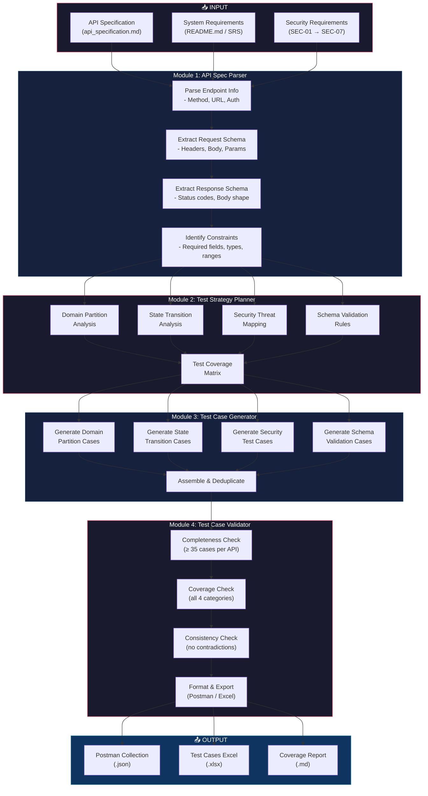
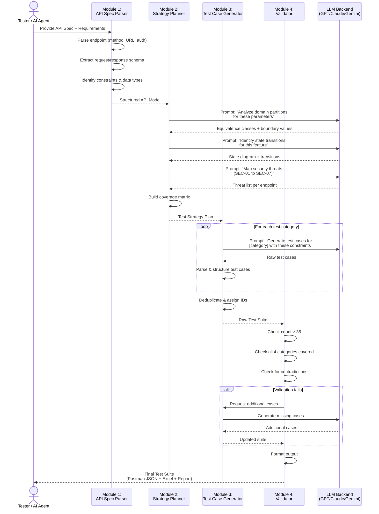
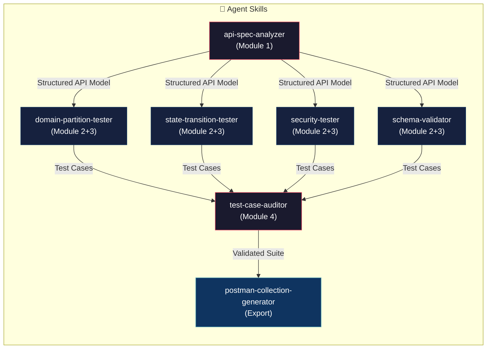
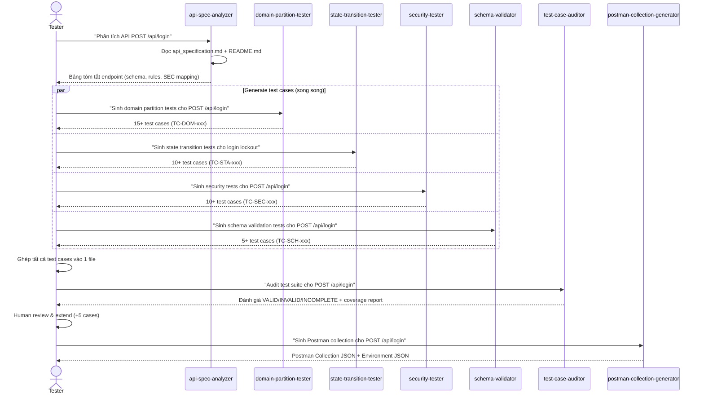

# Agent Skill — AI-Driven API Test Generator

## 1. Tổng quan thiết kế

### Mục tiêu
Thiết kế một hệ thống AI-driven có khả năng **tự động sinh test cases cho API** dựa trên:
- API Specification (endpoint, method, request/response schema)
- System Requirements (business rules, constraints)
- Security Requirements (SEC-01 đến SEC-07)

### Kiến trúc tổng quan — 4 Module Pipeline



### Sequence Diagram — Luồng xử lý chi tiết



---

## 2. Pseudocode chi tiết

### Module 1: API Spec Parser

```python
class APISpecParser:
    """
    Module 1: Parse API specification document and extract structured info.
    Input: Raw markdown/text API specification
    Output: List of APIEndpoint objects
    """

    def parse(self, spec_text: str, requirements_text: str) -> list[APIEndpoint]:
        endpoints = []

        # Step 1: Split specification into endpoint sections
        sections = self._split_into_sections(spec_text)

        for section in sections:
            endpoint = APIEndpoint()

            # Step 2: Extract HTTP method and URL path
            endpoint.method = self._extract_method(section)      # e.g., "POST"
            endpoint.url = self._extract_url(section)            # e.g., "/api/login"

            # Step 3: Extract authentication requirements
            endpoint.auth = self._extract_auth(section)
            # Returns: "none" | "bearer_user" | "bearer_admin"

            # Step 4: Extract request schema
            endpoint.request_body = self._extract_request_body(section)
            # Returns: dict of {field_name: {type, required, constraints}}
            # Example: {"email": {"type": "string", "required": true,
            #           "constraints": ["email_format"]}}

            endpoint.query_params = self._extract_query_params(section)
            endpoint.path_params = self._extract_path_params(section)

            # Step 5: Extract response schema
            endpoint.responses = self._extract_responses(section)
            # Returns: dict of {status_code: {body_schema, description}}
            # Example: {200: {"body": {"token": "string", "user": "object"}},
            #           401: {"body": {"error": "string"}}}

            # Step 6: Extract business rules from requirements doc
            endpoint.business_rules = self._extract_business_rules(
                requirements_text, endpoint.url
            )
            # Example: ["login_attempts increments by exactly 1",
            #           "lock after 3 consecutive failures for 30 seconds"]

            # Step 7: Map relevant security requirements
            endpoint.security_rules = self._map_security_requirements(
                endpoint, SECURITY_REQUIREMENTS  # SEC-01 to SEC-07
            )

            endpoints.append(endpoint)

        return endpoints

    def _extract_request_body(self, section: str) -> dict:
        """Parse JSON body example and infer field constraints."""
        json_block = self._find_json_code_block(section)
        if not json_block:
            return {}

        fields = {}
        for field_name, example_value in json_block.items():
            field_info = {
                "type": self._infer_type(example_value),
                "required": True,  # default; refined by requirements
                "example": example_value,
                "constraints": self._infer_constraints(field_name, example_value)
            }
            fields[field_name] = field_info

        return fields

    def _infer_constraints(self, field_name: str, value) -> list[str]:
        """Infer validation constraints from field name and value patterns."""
        constraints = []
        if "email" in field_name.lower():
            constraints.append("email_format")
        if "password" in field_name.lower():
            constraints.append("min_8_chars")
            constraints.append("has_uppercase")
            constraints.append("has_lowercase")
            constraints.append("has_digit")
            constraints.append("has_special_char")
        if "price" in field_name.lower():
            constraints.append("positive_number")
        if "phone" in field_name.lower():
            constraints.append("starts_with_0")
            constraints.append("10_to_11_digits")
        return constraints
```

### Module 2: Test Strategy Planner

```python
class TestStrategyPlanner:
    """
    Module 2: Analyze parsed API and create test strategy covering 4 categories.
    Input: APIEndpoint object
    Output: TestStrategy with coverage matrix
    """

    def plan(self, endpoint: APIEndpoint) -> TestStrategy:
        strategy = TestStrategy(endpoint=endpoint)

        # === Category 1: Domain Partitions ===
        strategy.domain_partitions = self._analyze_domain_partitions(endpoint)

        # === Category 2: State Transitions ===
        strategy.state_transitions = self._analyze_state_transitions(endpoint)

        # === Category 3: Security Tests ===
        strategy.security_tests = self._analyze_security_threats(endpoint)

        # === Category 4: Schema Validation ===
        strategy.schema_validations = self._analyze_schema(endpoint)

        # Build coverage matrix
        strategy.coverage_matrix = self._build_coverage_matrix(strategy)

        return strategy

    def _analyze_domain_partitions(self, endpoint: APIEndpoint) -> list[Partition]:
        """
        For each parameter, identify:
        - Equivalence classes (valid, invalid boundary partitions)
        - Boundary values
        - Special values (null, empty, whitespace, very long, special chars)
        """
        partitions = []

        for field_name, field_info in endpoint.request_body.items():
            field_partitions = Partition(field=field_name)

            if field_info["type"] == "string":
                field_partitions.valid_classes = [
                    "normal_valid_value",
                    "min_length_boundary",
                    "max_length_boundary"
                ]
                field_partitions.invalid_classes = [
                    "empty_string",
                    "null_value",
                    "missing_field",
                    "whitespace_only",
                    "exceeds_max_length",
                    "special_characters",
                    "unicode_characters"
                ]

                # Add constraint-specific partitions
                if "email_format" in field_info.get("constraints", []):
                    field_partitions.valid_classes += ["standard_email"]
                    field_partitions.invalid_classes += [
                        "no_at_sign", "no_domain", "double_at",
                        "spaces_in_email", "sql_injection_in_email"
                    ]

            elif field_info["type"] == "number":
                field_partitions.valid_classes = [
                    "positive_normal", "min_boundary", "large_value"
                ]
                field_partitions.invalid_classes = [
                    "zero", "negative", "string_value", "null",
                    "decimal", "extremely_large"
                ]

            partitions.append(field_partitions)

        return partitions

    def _analyze_state_transitions(self, endpoint: APIEndpoint) -> list[StateTransition]:
        """
        Identify state machines relevant to the endpoint.
        Use LLM to analyze business rules and identify states.
        """
        transitions = []

        for rule in endpoint.business_rules:
            prompt = f"""
            Given this business rule: "{rule}"
            Identify:
            1. The states involved
            2. Valid transitions (from_state -> action -> to_state)
            3. Invalid transitions that should be rejected
            """
            llm_result = self.llm.analyze(prompt)
            transitions.extend(self._parse_transitions(llm_result))

        return transitions

    def _analyze_security_threats(self, endpoint: APIEndpoint) -> list[SecurityTest]:
        """Map SEC-01 to SEC-07 to specific test scenarios for this endpoint."""
        threats = []
        sec_mapping = {
            "SEC-01": {"test": "check_password_not_plaintext",
                       "applies_to": ["register", "login", "reset-password"]},
            "SEC-02": {"test": "require_valid_jwt",
                       "applies_to": ["authenticated_endpoints"]},
            "SEC-03": {"test": "require_admin_role",
                       "applies_to": ["admin_endpoints"]},
            "SEC-04": {"test": "xss_injection_in_inputs",
                       "applies_to": ["all_endpoints_with_input"]},
            "SEC-05": {"test": "sql_injection_in_params",
                       "applies_to": ["all_endpoints_with_input"]},
            "SEC-06": {"test": "prevent_role_escalation",
                       "applies_to": ["profile_update"]},
            "SEC-07": {"test": "otp_entropy_and_expiry",
                       "applies_to": ["forgot-password", "reset-password"]},
        }

        for sec_id, sec_info in sec_mapping.items():
            if self._applies_to_endpoint(endpoint, sec_info["applies_to"]):
                threats.append(SecurityTest(
                    sec_id=sec_id,
                    test_type=sec_info["test"],
                    endpoint=endpoint
                ))

        return threats

    def _build_coverage_matrix(self, strategy: TestStrategy) -> dict:
        """Ensure all 4 categories have sufficient test cases."""
        return {
            "domain_partitions": len(strategy.domain_partitions),
            "state_transitions": len(strategy.state_transitions),
            "security_tests": len(strategy.security_tests),
            "schema_validations": len(strategy.schema_validations),
            "total_estimated": (
                len(strategy.domain_partitions) * 2  # valid + invalid per partition
                + len(strategy.state_transitions)
                + len(strategy.security_tests)
                + len(strategy.schema_validations)
            )
        }
```

### Module 3: Test Case Generator

```python
class TestCaseGenerator:
    """
    Module 3: Generate concrete test cases from strategy plan.
    Input: TestStrategy
    Output: List of TestCase objects
    """

    def generate(self, strategy: TestStrategy) -> list[TestCase]:
        all_cases = []
        test_id_counter = 1

        # === Generate Domain Partition test cases ===
        for partition in strategy.domain_partitions:
            prompt = f"""
            Generate API test cases for endpoint {strategy.endpoint.method} {strategy.endpoint.url}
            Field: {partition.field}
            Valid equivalence classes: {partition.valid_classes}
            Invalid equivalence classes: {partition.invalid_classes}

            For each class, provide:
            - Test case name (descriptive, in English)
            - Input data (complete request body/params)
            - Expected HTTP status code
            - Expected response body pattern
            - Preconditions (if any)

            Format as structured JSON.
            """
            raw_cases = self.llm.generate(prompt)
            cases = self._parse_and_structure(raw_cases, "DOMAIN", test_id_counter)
            all_cases.extend(cases)
            test_id_counter += len(cases)

        # === Generate State Transition test cases ===
        for transition in strategy.state_transitions:
            prompt = f"""
            Generate API test cases for state transition:
            Endpoint: {strategy.endpoint.method} {strategy.endpoint.url}
            Transition: {transition.from_state} --[{transition.action}]--> {transition.to_state}
            Is valid: {transition.is_valid}

            Include:
            - Setup steps (preconditions to reach from_state)
            - The action (API call)
            - Verification (expected status + response + DB state)
            """
            raw_cases = self.llm.generate(prompt)
            cases = self._parse_and_structure(raw_cases, "STATE", test_id_counter)
            all_cases.extend(cases)
            test_id_counter += len(cases)

        # === Generate Security test cases ===
        for threat in strategy.security_tests:
            prompt = f"""
            Generate security test cases for:
            Endpoint: {strategy.endpoint.method} {strategy.endpoint.url}
            Security requirement: {threat.sec_id}
            Test type: {threat.test_type}

            Include attack payloads and expected secure responses.
            """
            raw_cases = self.llm.generate(prompt)
            cases = self._parse_and_structure(raw_cases, "SECURITY", test_id_counter)
            all_cases.extend(cases)
            test_id_counter += len(cases)

        # === Generate Schema Validation test cases ===
        for schema_rule in strategy.schema_validations:
            prompt = f"""
            Generate schema validation test cases for:
            Endpoint: {strategy.endpoint.method} {strategy.endpoint.url}
            Expected response schema: {schema_rule.expected_schema}

            Verify: field names, data types, required fields, nested objects.
            """
            raw_cases = self.llm.generate(prompt)
            cases = self._parse_and_structure(raw_cases, "SCHEMA", test_id_counter)
            all_cases.extend(cases)
            test_id_counter += len(cases)

        # === Deduplicate ===
        all_cases = self._deduplicate(all_cases)

        return all_cases

    def _parse_and_structure(self, raw: str, category: str, start_id: int) -> list[TestCase]:
        """Convert LLM raw output into structured TestCase objects."""
        cases = []
        parsed = json.loads(raw)

        for i, raw_case in enumerate(parsed):
            case = TestCase(
                id=f"TC-{category[:3]}-{start_id + i:03d}",
                category=category,
                name=raw_case["name"],
                endpoint=raw_case.get("endpoint", ""),
                method=raw_case.get("method", ""),
                request_headers=raw_case.get("headers", {}),
                request_body=raw_case.get("body", {}),
                request_params=raw_case.get("params", {}),
                expected_status=raw_case["expected_status"],
                expected_body=raw_case.get("expected_body", {}),
                preconditions=raw_case.get("preconditions", []),
                postconditions=raw_case.get("postconditions", []),
            )
            cases.append(case)

        return cases

    def _deduplicate(self, cases: list[TestCase]) -> list[TestCase]:
        """Remove duplicate test cases based on input + expected output similarity."""
        seen = set()
        unique = []
        for case in cases:
            fingerprint = (
                case.method, case.endpoint,
                json.dumps(case.request_body, sort_keys=True),
                case.expected_status
            )
            if fingerprint not in seen:
                seen.add(fingerprint)
                unique.append(case)
        return unique
```

### Module 4: Test Case Validator

```python
class TestCaseValidator:
    """
    Module 4: Validate the generated test suite for completeness and quality.
    Input: List of TestCase objects
    Output: Validated suite + coverage report
    """

    MIN_CASES_PER_API = 35
    REQUIRED_CATEGORIES = ["DOMAIN", "STATE", "SECURITY", "SCHEMA"]

    def validate(self, cases: list[TestCase], endpoint: APIEndpoint) -> ValidationResult:
        result = ValidationResult()

        # Check 1: Minimum count
        if len(cases) < self.MIN_CASES_PER_API:
            result.add_issue(
                "INSUFFICIENT_COUNT",
                f"Only {len(cases)} cases, need ≥ {self.MIN_CASES_PER_API}"
            )
            # Request generator to produce more cases
            result.needs_more = True
            result.deficit = self.MIN_CASES_PER_API - len(cases)

        # Check 2: All 4 categories covered
        present_categories = set(c.category for c in cases)
        missing = set(self.REQUIRED_CATEGORIES) - present_categories
        if missing:
            result.add_issue(
                "MISSING_CATEGORY",
                f"Missing categories: {missing}"
            )
            result.missing_categories = list(missing)

        # Check 3: Category distribution balance
        category_counts = Counter(c.category for c in cases)
        for cat in self.REQUIRED_CATEGORIES:
            count = category_counts.get(cat, 0)
            if count < 3:
                result.add_issue(
                    "LOW_CATEGORY_COUNT",
                    f"Category {cat} has only {count} cases (recommend ≥ 5)"
                )

        # Check 4: No contradictions (same input → different expected output)
        contradictions = self._find_contradictions(cases)
        if contradictions:
            result.add_issue(
                "CONTRADICTIONS",
                f"Found {len(contradictions)} contradicting test case pairs"
            )

        # Check 5: Security coverage
        security_cases = [c for c in cases if c.category == "SECURITY"]
        covered_sec_ids = set()
        for c in security_cases:
            for sec_id in ["SEC-01", "SEC-02", "SEC-03", "SEC-04", "SEC-05", "SEC-06", "SEC-07"]:
                if sec_id.lower() in c.name.lower() or sec_id in str(c.preconditions):
                    covered_sec_ids.add(sec_id)

        applicable_secs = set(sr.sec_id for sr in endpoint.security_rules)
        uncovered = applicable_secs - covered_sec_ids
        if uncovered:
            result.add_issue(
                "UNCOVERED_SECURITY",
                f"Security requirements not tested: {uncovered}"
            )

        # Generate coverage report
        result.coverage_report = {
            "total_cases": len(cases),
            "by_category": dict(category_counts),
            "security_coverage": list(covered_sec_ids),
            "is_valid": len(result.issues) == 0
        }

        return result

    def export_to_postman(self, cases: list[TestCase], endpoint: APIEndpoint) -> dict:
        """Convert test cases to Postman collection JSON format."""
        collection = {
            "info": {
                "name": f"HW06 - {endpoint.url}",
                "schema": "https://schema.getpostman.com/json/collection/v2.1.0/collection.json"
            },
            "item": []
        }

        # Group by category into folders
        for category in self.REQUIRED_CATEGORIES:
            folder = {"name": category, "item": []}
            category_cases = [c for c in cases if c.category == category]

            for case in category_cases:
                item = {
                    "name": f"{case.id}: {case.name}",
                    "request": {
                        "method": case.method,
                        "header": [
                            {"key": k, "value": v}
                            for k, v in case.request_headers.items()
                        ],
                        "url": {
                            "raw": "{{base_url}}" + case.endpoint,
                            "host": ["{{base_url}}"],
                            "path": case.endpoint.strip("/").split("/")
                        },
                        "body": {
                            "mode": "raw",
                            "raw": json.dumps(case.request_body, indent=2),
                            "options": {"raw": {"language": "json"}}
                        }
                    },
                    "event": [{
                        "listen": "test",
                        "script": {
                            "exec": self._generate_test_script(case)
                        }
                    }, {
                        "listen": "prerequest",
                        "script": {
                            "exec": [
                                'pm.request.headers.add({',
                                '    key: "X-Student-Id",',
                                '    value: pm.environment.get("student_id")',
                                '});'
                            ]
                        }
                    }]
                }
                folder["item"].append(item)

            collection["item"].append(folder)

        return collection

    def _generate_test_script(self, case: TestCase) -> list[str]:
        """Generate Postman test script for a test case."""
        scripts = [
            f'pm.test("{case.id}: {case.name}", function () {{',
            f'    pm.response.to.have.status({case.expected_status});',
        ]

        if case.expected_body:
            scripts.append('    var jsonData = pm.response.json();')
            for key, expected_value in case.expected_body.items():
                if isinstance(expected_value, str):
                    scripts.append(
                        f'    pm.expect(jsonData.{key}).to.eql("{expected_value}");'
                    )
                else:
                    scripts.append(
                        f'    pm.expect(jsonData.{key}).to.eql({expected_value});'
                    )

        scripts.append('});')
        return scripts
```

### Main — Orchestrator

```python
def generate_api_tests(api_spec_path: str, requirements_path: str,
                        target_endpoint: str) -> dict:
    """
    Main entry point: orchestrate the 4-module pipeline.

    Args:
        api_spec_path: Path to api_specification.md
        requirements_path: Path to README.md (SRS)
        target_endpoint: e.g., "POST /api/login"

    Returns:
        dict with postman_collection, test_cases_excel, coverage_report
    """
    # Module 1: Parse
    parser = APISpecParser()
    spec_text = read_file(api_spec_path)
    requirements_text = read_file(requirements_path)
    endpoints = parser.parse(spec_text, requirements_text)

    # Find target endpoint
    target = find_endpoint(endpoints, target_endpoint)

    # Module 2: Plan strategy
    planner = TestStrategyPlanner(llm=LLMClient())
    strategy = planner.plan(target)

    # Module 3: Generate test cases
    generator = TestCaseGenerator(llm=LLMClient())
    test_cases = generator.generate(strategy)

    # Module 4: Validate & export
    validator = TestCaseValidator()
    result = validator.validate(test_cases, target)

    # If validation fails, regenerate missing parts
    while not result.coverage_report["is_valid"]:
        if result.needs_more:
            additional = generator.generate_additional(
                strategy, result.deficit, result.missing_categories
            )
            test_cases.extend(additional)
        result = validator.validate(test_cases, target)

    # Export
    postman_collection = validator.export_to_postman(test_cases, target)
    coverage_report = result.coverage_report

    return {
        "postman_collection": postman_collection,
        "test_cases": test_cases,
        "coverage_report": coverage_report
    }


# === Usage ===
if __name__ == "__main__":
    # Generate tests for FR-02: Login & Account Lockout
    result = generate_api_tests(
        api_spec_path="api_specification.md",
        requirements_path="README.md",
        target_endpoint="POST /api/login"
    )

    # Save Postman collection
    save_json(result["postman_collection"],
              "collections/FR02_Login.postman_collection.json")

    # Print coverage
    print(f"Generated {len(result['test_cases'])} test cases")
    print(f"Coverage: {result['coverage_report']}")
```

---

## 3. Design Decisions & Rationale

| Decision | Rationale |
|---|---|
| **4-module pipeline** | Separation of concerns: parsing, planning, generation, validation are independent steps |
| **LLM-assisted (not LLM-only)** | LLM generates test ideas, but structure/validation is deterministic code |
| **Iterative validation loop** | Ensures minimum 35 cases and all 4 categories are covered |
| **Security mapping table** | Systematic coverage of SEC-01→07 instead of ad-hoc prompting |
| **Deduplication by fingerprint** | Prevents LLM from generating semantically identical test cases |
| **Postman-native export** | Direct integration with Newman for CI/CD execution |
| **Category-based folders** | Organized structure for audit and review |

---

## 4. Limitations & Mitigations

| Limitation | Mitigation |
|---|---|
| LLM may hallucinate API endpoints | Module 1 parser grounds everything in actual spec |
| LLM may miss edge cases | Module 4 validator ensures coverage; human extends in Step 3 |
| LLM output format inconsistency | Structured prompts + JSON parsing with fallback |
| Cannot verify actual API behavior | Separate execution phase (Newman) validates against live SUT |

---

## 5. Agent Skills Mapping — Ánh xạ Module → Skill

Pipeline 4 module được hiện thực hóa thành **7 Agent Skills** (Antigravity SKILL.md), mỗi skill có thể trigger độc lập hoặc sử dụng tuần tự theo pipeline.



| Module trong Design | Agent Skill tương ứng | Trigger Keyword |
|---|---|---|
| Module 1: API Spec Parser | `api-spec-analyzer` | "phân tích API spec", "parse endpoint" |
| Module 2+3: Domain Partitions | `domain-partition-tester` | "domain partition", "equivalence partitioning", "boundary value" |
| Module 2+3: State Transitions | `state-transition-tester` | "state transition", "state machine", "trạng thái" |
| Module 2+3: Security Tests | `security-tester` | "security test", "bảo mật", "SQL injection", "XSS" |
| Module 2+3: Schema Validation | `schema-validator` | "schema validation", "response shape" |
| Module 4: Validator | `test-case-auditor` | "audit test", "review test cases", "coverage check" |
| Export: Postman | `postman-collection-generator` | "postman collection", "newman", "generate postman" |

---

## 6. Bảng ánh xạ Security Requirements → Test Techniques

| SEC ID | Yêu cầu | Test Techniques | Attack Payloads |
|--------|---------|-----------------|-----------------|
| SEC-01 | Password không plaintext | Response inspection, DB query | Check response body không chứa field `password` |
| SEC-02 | JWT Token hợp lệ | Token manipulation | No token, expired token, malformed token (`abc.def`), token thiếu signature |
| SEC-03 | Admin role check | Privilege escalation | User token → admin endpoints (`/api/admin/*`, `POST /api/products`) |
| SEC-04 | XSS prevention | Input injection | `<script>alert(1)</script>`, ``, `javascript:alert(1)` |
| SEC-05 | SQL injection prevention | Input injection | `' OR 1=1 --`, `' UNION SELECT * FROM users --`, time-based blind SQLi |
| SEC-06 | Role escalation prevention | Mass assignment | `PUT /api/users/me` với `{role: "admin"}`, `{is_admin: true}` |
| SEC-07 | OTP security | Brute force, replay | OTP brute force, reuse OTP đã dùng, OTP cho email khác, OTP hết hạn |

---

## 7. Các phương diện kiểm thử bổ sung (ngoài 4 category chính)

### 7.1 IDOR (Insecure Direct Object Reference)

Kiểm tra user A **không thể** truy cập resource của user B bằng cách thay đổi ID trong URL.

| Scenario | API | Payload |
|----------|-----|---------|
| Xem đơn hàng người khác | `GET /api/orders/:id` | User A token + order ID của user B |
| Hủy đơn hàng người khác | `PUT /api/orders/:id/cancel` | User A token + order ID của user B |
| Xem profile người khác | `GET /api/users/me` | Verify chỉ trả về data của chính user |

### 7.2 Mass Assignment

Gửi thêm field không cho phép trong request body để thay đổi thuộc tính nội bộ.

| Scenario | API | Payload |
|----------|-----|---------|
| Tự nâng role | `PUT /api/users/me` | `{name: "Test", role: "admin"}` |
| Đổi ID | `PUT /api/users/me` | `{name: "Test", id: 999}` |
| Thêm field lạ | `POST /api/register` | `{name: "Test", email: "...", password: "...", is_admin: true}` |

### 7.3 Idempotency

Gọi API nhiều lần liên tiếp, kết quả phải nhất quán.

| Scenario | API | Expected |
|----------|-----|----------|
| Đăng ký 2 lần cùng email | `POST /api/register` | Lần 2 trả lỗi "email exists" |
| Checkout 2 lần liên tiếp | `POST /api/checkout` | Lần 2 trả lỗi (giỏ hàng đã trống) |
| Apply coupon 2 lần | `POST /api/apply-coupon` | Lần 2 vẫn trả đúng (idempotent) hoặc lỗi (nếu usage tracking) |
| Cancel order 2 lần | `PUT /api/orders/:id/cancel` | Lần 2 trả lỗi (đã canceled) |

### 7.4 Rate Limiting & Performance

| Scenario | API | Expected |
|----------|-----|----------|
| 100 login attempts liên tiếp | `POST /api/login` | Account lockout + không crash server |
| Rapid cart additions | `POST /api/cart` | Xử lý đúng, không duplicate |
| Concurrent order status updates | `PUT /api/admin/orders/:id/status` | Không race condition |

### 7.5 Error Handling & Information Disclosure

| Scenario | API | Expected |
|----------|-----|----------|
| Invalid JSON body | Any POST/PUT | 400, không 500 |
| Wrong Content-Type | Any POST/PUT | 400 hoặc xử lý graceful |
| Very large request body (>1MB) | Any POST/PUT | 413 hoặc reject, không crash |
| Server error response | Trigger 500 | Không leak stack trace, DB schema, file paths |

---

## 8. Workflow thực tế — Sử dụng Agent Skills


