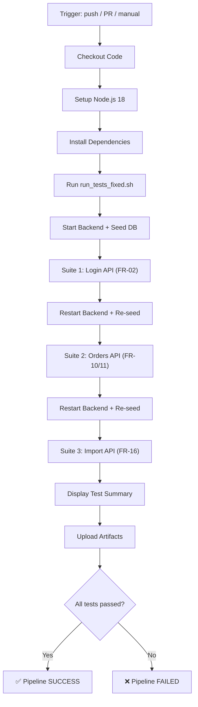

# CI/CD Report — EShop API Testing

> **Sinh viên:** Nguyễn Gia Huy — 23127378  
> **Lớp:** 23KTPM2  
> **Môn:** Kiểm thử phần mềm (HW06 — API Testing)

---

## 1. Pipeline Configuration

CI/CD pipeline được thiết lập bằng **GitHub Actions**, file cấu hình tại [`.github/workflows/api-test.yml`](../../.github/workflows/api-test.yml).

| Thuộc tính | Chi tiết |
|---|---|
| **Triggers** | `push` lên `main`/`master`, `pull_request` vào `main`/`master`, `workflow_dispatch` (chạy thủ công) |
| **Runner** | `ubuntu-latest` |
| **Node.js** | v18 (cached via `actions/setup-node@v4`) |
| **Test Runner** | Newman (CLI runner cho Postman collections) |

### Pipeline Steps

| # | Step | Mô tả |
|---|---|---|
| 1 | **Checkout Code** | Clone repo bằng `actions/checkout@v4` |
| 2 | **Setup Node.js** | Cài đặt Node.js 18 với npm cache |
| 3 | **Install Dependencies** | `npm install` ở root và `backend/` |
| 4 | **Run API Tests** | Thực thi `run_tests_fixed.sh` — chạy 3 Newman test suites |
| 5 | **Display Summary** | In `reports/summary.md` ra console (chạy `always()`) |
| 6 | **Upload Artifacts** | Upload HTML/JSON reports lên GitHub (chạy `always()`) |

### Runner Script — `run_tests_fixed.sh`

Script `run_tests_fixed.sh` thực hiện quy trình test tự động hóa hoàn chỉnh:

1. **Khởi động backend server** (Express.js + MongoDB)
2. **Seed database** với dữ liệu test ban đầu
3. **Chạy 3 Newman test suites tuần tự** với cơ chế **isolation** — restart backend giữa mỗi suite để đảm bảo dữ liệu sạch
4. **Tổng hợp kết quả** vào `summary.md`

---

## 2. Pipeline Flow



---

## 3. Sample Run 1 — All Tests Passing ✅

> 📸 Screenshot: `[TODO: Chụp screenshot GitHub Actions run với tất cả tests pass]`  
> 🔗 Link: `[TODO: ĐIỀN LINK GITHUB ACTIONS RUN]`  
> Commit: `[TODO: ĐIỀN COMMIT HASH]`

Run này thể hiện toàn bộ **135 test cases** thực thi thành công trên 3 API test suites:

| Suite | Collection | Số test cases | Kết quả |
|---|---|---|---|
| FR-02 | Login API | 45 | ✅ Pass |
| FR-10/11 | Orders API | 45 | ✅ Pass |
| FR-16 | Import API | 45 | ✅ Pass |
| **Tổng** | | **135** | **✅ All Passed** |

Pipeline hoàn thành với status **SUCCESS** (exit code 0), xác nhận tất cả API endpoints hoạt động đúng theo specifications.

---

## 4. Sample Run 2 — One Test Failing ❌

> 📸 Screenshot: `[TODO: Chụp screenshot GitHub Actions run với 1 test fail]`  
> 🔗 Link: `[TODO: ĐIỀN LINK GITHUB ACTIONS RUN]`  
> Commit: `[TODO: ĐIỀN COMMIT HASH]`

Run này chứng minh pipeline **phát hiện và báo cáo chính xác** các test case thất bại.

**Cách tạo failing run:** Chỉnh sửa một test case trong collection, thay đổi expected status code (ví dụ: đổi `200` thành `201`) để gây ra assertion failure có chủ đích.

Pipeline kết thúc với status **FAILED** (exit code ≠ 0), Newman report hiển thị chi tiết:
- Test case nào fail
- Expected vs. Actual response
- Request/Response details để debug

Điều này đảm bảo rằng CI/CD pipeline hoạt động như một **safety net** — ngăn chặn regression bugs trước khi merge vào main branch.

---

## 5. Artifacts

Pipeline upload test reports dưới dạng **GitHub Actions Artifacts** (tên: `EShop_API_TestReports`):

| File | Mô tả |
|---|---|
| `LoginReport.html` | Báo cáo HTML cho Login API test suite |
| `LoginReport.json` | Kết quả JSON chi tiết cho Login API |
| `OrdersReport.html` | Báo cáo HTML cho Orders API test suite |
| `OrdersReport.json` | Kết quả JSON chi tiết cho Orders API |
| `ImportReport.html` | Báo cáo HTML cho Import API test suite |
| `ImportReport.json` | Kết quả JSON chi tiết cho Import API |
| `summary.md` | Tổng hợp kết quả tất cả suites |

> [!NOTE]
> Artifacts được lưu trữ trên GitHub trong **90 ngày** và có thể download từ trang Actions run.

---

## 6. How to Reproduce

### Chạy trên GitHub Actions

Push code lên `main`/`master` hoặc tạo Pull Request — pipeline sẽ tự động trigger. Có thể chạy thủ công tại tab **Actions** → **Run workflow**.

### Chạy locally

```bash
# Từ thư mục gốc project
cd api-test
chmod +x run_tests_fixed.sh
./run_tests_fixed.sh
```

**Yêu cầu:**
- Node.js ≥ 18
- MongoDB đang chạy (hoặc MongoDB Atlas connection string trong `.env`)
- Đã cài đặt dependencies (`npm install` ở root và `backend/`)

Kết quả test sẽ được xuất ra thư mục `api-test/reports/`.

---

*Report generated for HW06 — API Testing, Kiểm thử phần mềm, HCMUS.*
